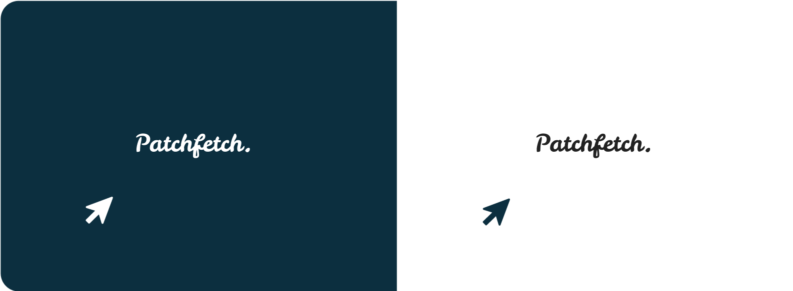

# Web Scraper Project



Project I'm currently working on using the Headless Chrome Node.js API, Puppeteer.

Ever interested in returning to a game you havn't played in awhile? Well... I have and with updates for games coming out quite frequently these days I wanted to develop a tool to help me find and display all the patch notes for a game since I last played.

So after some research Puppeteer was the best choice for me.

## Setup:

run :

```bash
  npm i && npm start
```

for both client and server side to start the development server

### [Live Site](https://web-scraper-project.herokuapp.com/)
